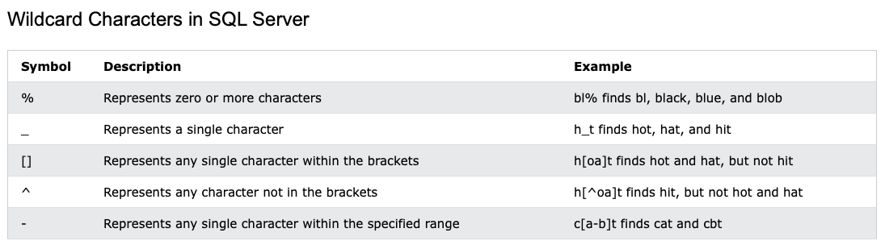
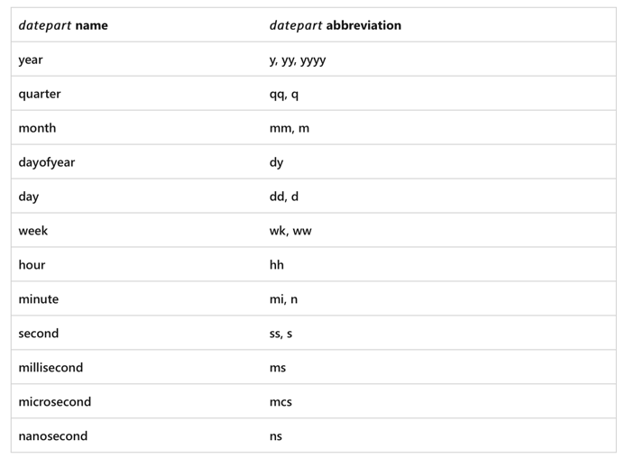
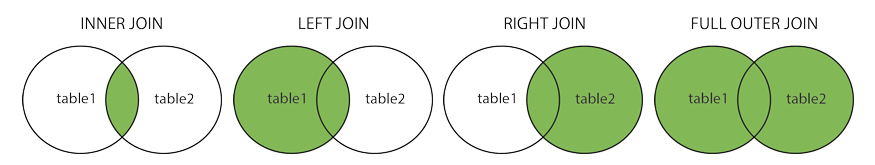

# SQL - Structured Query Language

Reference:
- [learn.microsoft sql](https://learn.microsoft.com/en-us/sql/t-sql/functions/date-and-time-data-types-and-functions-transact-sql?view=sql-server-ver16)(got more detail, like date functions)
- https://www.w3schools.com/sql/sql_intro.asp
- [SQL必知必会] [本 福达]

## SQL Introduction
SQL lets you access and manipulate databases

SQL became a standard of the American National Standards Institute (ANSI) in 1986, and of the International Organization for Standardization 
Although ANSI/ISO standard, there are different versions of the SQL language. However, to be compliant with the ANSI standard, they all support at least the major commands (such as **SELECT, UPDATE, DELETE, INSERT, WHERE**) in a similar manner.

RDBMS stands for Relational Database Management System.

## 数据库基础元素

- database
- table
- schema: 模式， 模式可以用来描述数据库中特定的表，也可以用来描述整个数据库（和其中表的关系）
- 列
- 数据类型，数据类型及其名称是SQL不兼容的一个主要原因
- 行, a record
- 主键，唯一，不为空，不允许被修改，删除后不能被重用

## Syntax
- SQL keywords are NOT case-sensitive
- Semicolon after SQL statements

## Some of The Most Important SQL Commands

```sql
SELECT - extracts data from a database
UPDATE - updates data in a database
DELETE - deletes data from a database
INSERT INTO - inserts new data into a database
CREATE DATABASE - creates a new database
ALTER DATABASE - modifies a database
CREATE TABLE - creates a new table
ALTER TABLE - modifies a table
DROP TABLE - deletes a table
CREATE INDEX - creates an index (search key)
DROP INDEX - deletes an index
```

### SQL select examples
select 子句顺序:
1. SELECT
2. FROM
3. WHERE
4. GROUP BY
5. HAVING
6. ORDER BY

```sql
SELECT * FROM Customers;
SELECT CustomerName, City FROM Customers;
-- distinct必须放列名前面， 不能部分使用distinct
SELECT DISTINCT column1, column2 FROM table_name;

SELECT * FROM Customers WHERE Country = 'Spain' AND CustomerName LIKE 'G%';
SELECT * FROM Products WHERE Price BETWEEN 50 AND 60;
SELECT * FROM Customers WHERE City IN ('Paris','London');
-- 复杂条件用not可以使查询变得简单
SELECT * FROM Customers WHERE NOT City IN ('Paris','London');
SELECT * FROM Customers WHERE City is NULL;
SELECT * FROM Customers WHERE City is NOT NULL;
-- %aaa%, %aaa, aaa%, a%b, a%b%, _pple, _a%, a_%, a__%, 
-- []匹配字符集， [abc]表示a或b或c， [^abc]表示非a非b非c
-- 使用通配符搜索会慢一些，其他的方式可以用的就不用通配符
SELECT * FROM Customers WHERE City LIKE 's%';


/*limit
Oracle, where rownum <= 5  
MySQL, limit 5  
DB2, fetch first 5 rows only */
SELECT TOP 5 prod_name FROM Products;

SELECT column1, column2, ...
FROM table_name
ORDER BY column1, column2, ... ASC|DESC;

SELECT * FROM Customers
ORDER BY Country ASC, CustomerName DESC;

-- 拼接字段
SELECT vendor_name+ '(' + vendor_country + ')' FROM Vendors order by vendor_name;
-- RTRIM, LTRIM, TRIM
SELECT RTRIM(vendor_name) + '(' + RTRIM(vendor_country) + ')' FROM Vendors order by vendor_name;

-- group by
/* group by 可以包含多个列
group by 子句必须是检索列或有效的表达式，不能是聚集函数
group by 必须是where之后，order by之前
*/
SELECT vend_id, COUNT(*) as num_prods FROM Products GROUP BY vend_id;

-- having过滤分组
-- where 在分组前过滤行， having 在分组后过滤组
select cust_id, count(*) as orders from Orders group by cust_id having count(*) >= 2;
select vend_id, count(*) as num_prods from Products where prod_price >= 4 group by vend_id having count(*) >= 2;
select order_num, count(*) as items from OrderItems group by order_num having count(*) >= 2 order by items desc;
```



### 使用函数
大多数SQL实现支持以下类型的函数：
- 用于处理文本字符串的函数，如删除或填充值，转换值为大写或小写
- 用于处理日期和时间值的函数， 如从日期中提取部分值， 返回日期之差，检查日期有效性
- 用于数值数据的函数， 如返回绝对值，舍入值，代数运算
- 用于生成格式化的内容的函数， 如格式化数字或日期，货币格式化


```sql
select vend_name, upper(vend_name) as vend_name_upcase from Vendors order by vend_name;

```
#### 常用的文本处理函数：
- LEFT, RIGHT, SUBSTRING
- LTRIM, RTRIM, TRIM
- LOWER, UPPER
- LENGTH

#### 常用的日期和时间处理函数：
- DATEPART, DATEDIFF, DATEADD
- GETDATE, GETUTCDATE


for more, [learn.microsoft date](https://learn.microsoft.com/en-us/sql/t-sql/functions/date-and-time-data-types-and-functions-transact-sql?view=sql-server-ver16)

```sql
select order_num, order_date, DATEPART(yy, order_date) as order_year, DATEPART(mm, order_date) as order_month from Orders;

DATEDIFF ( datepart , startdate , enddate )
SELECT DATEDIFF(year,        '2005-12-31 23:59:59.9999999', '2006-01-01 00:00:00.0000000');
SELECT DATEDIFF(quarter,     '2005-12-31 23:59:59.9999999', '2006-01-01 00:00:00.0000000');
SELECT DATEDIFF(month,       '2005-12-31 23:59:59.9999999', '2006-01-01 00:00:00.0000000');
SELECT DATEDIFF(day,         '2005-12-31 23:59:59.9999999', '2006-01-01 00:00:00.0000000');
SELECT DATEDIFF(week,        '2005-12-31 23:59:59.9999999', '2006-01-01 00:00:00.0000000');
DATEADD (datepart , number , date )
SELECT DATEADD(month, 1, '20060830');
SELECT DATEADD(month, 1, '2006-08-31');

```



#### 聚集函数
- AVG, COUNT, MAX, MIN, SUM

### 子查询
```sql
select cust_id 
from orders 
where order_num in (select order_num from orderitems where prod_id = 'RGAN01');

select cust_name, 
    cust_state, 
    (select count(*) from orders where orders.cust_id = customers.cust_id) as orders
from customers order by cust_name;
```

### 联结表



### 组合查询
union

主要有两种情况需要使用组合查询：
- 在一个查询中从不同的表返回类似结构的数据
- 对一个表执行多个查询， 按单个查询返回的结果组合成一个结果集
任何具有多个where子句的查询都可以重写为使用union的查询

union自动去除了重复的行，如果想保留重复的行，使用union all

```sql


```sql
select cust_name, cust_contact, cust_email
from customers
where cust_state in ('IL', 'IN', 'MI')
union
select cust_name, cust_contact, cust_email
from customers
where cust_name = 'Fun4All';
```

```sql
select cust_name, cust_contact, cust_email
from customers
where cust_state in ('IL', 'IN', 'MI') or cust_name = 'Fun4All';
```
这个例子中，union可能比where子句复杂些，但对于较复杂的过滤条件，或者从多个表中检索数据，使用union可能更简单


### 插入数据

插入有几种方式
- 插入完整的行
- 插入行的一部分
- 插入某些查询的结果


```sql
-- 这里值要按顺序填充，如果和列对应不上，不太安全
insert into customers
values ('1000000006', 'Toy Land', '123 Any Street', 'New York', 'NY', '11111', 'USA', NULL, NULL);

insert into customers(cust_id, cust_name, cust_address, cust_city, cust_state, cust_zip, cust_country, cust_contact, cust_email)
values ('1000000006', 'Toy Land', '123 Any Street', 'New York', 'NY', '11111', 'USA', NULL, NULL);

-- 插入行的一部分
insert into customers(cust_id, cust_name, cust_address, cust_city, cust_state, cust_zip, cust_country)
values ('1000000006', 'Toy Land', '123 Any Street', 'New York', 'NY', '11111', 'USA');

-- 插入检索出的数据
insert into customers(cust_id, cust_name, cust_address, cust_city, cust_state, cust_zip, cust_country)
select cust_id, cust_name, cust_address, cust_city, cust_state, cust_zip, cust_country
from custnew;

-- 从一个表复制到另一个表
-- create xxx select xxx
create table custcopy as select * from customers;
select * into custcopy from custcomers;
```

### 更新和删除数据

```sql
-- update 不要忘记where条件
update customers
set cust_email = 'kim@163.com',
    cust_contact = 'Kim Kim'
where cust_id = '1000000006';

-- delete 不要忘记where条件
delete from customers
where cust_id = '1000000006';
```

使用update和delete的规则
- 除非必要，否则都带上where
- select先测试，然后再update或delete
- 使用强制实施引用完整性的数据库，可以防止删除与其他表关联的行


## 创建和操纵表

```sql
-- create table products
create table products
(
    prod_id char(10) NOT NULL,
    vend_id char(10) NOT NULL,
    prod_name char(255) NOT NULL,
    prod_price decimal(8,2) NOT NULL,
    prod_desc varchar(1000) NULL
);

-- 指定默认值 with default
create table orders
(
    order_num int NOT NULL,
    order_date datetime NOT NULL DEFAULT GETDATE(),
    cust_id char(10) NOT NULL
);

-- update table
ALTER TABLE Vendors
ADD vend_phone CHAR(20);

ALTER TABLE Vendors
DROP COLUMN vend_phone;

-- delete table
drop table vendors;

-- rename table
SQL Server 用sp_rename存储过程
```

### 存储过程

存储过程，即把过程（一段sql statement）存储在数据库中，可以在需要的时候调用
```sql
CREATE PROCEDURE procedure_name
AS
sql_statement
GO;
```

```sql
-- 执行存储过程
EXEC procedure_name;
```

```sql
CREATE PROCEDURE SelectAllCustomers 
    @City nvarchar(30)
AS
    SELECT * FROM Customers WHERE City = @City
GO;

EXEC SelectAllCustomers @City = 'London';

CREATE PROCEDURE SelectAllCustomers 
    @City nvarchar(30), 
    @PostalCode nvarchar(10)
AS
    SELECT * FROM Customers WHERE City = @City AND PostalCode = @PostalCode
GO;

EXEC SelectAllCustomers @City = 'London', @PostalCode = 'WA1 1DP';

USE AdventureWorks2022;  
GO  
CREATE PROCEDURE HumanResources.uspGetEmployeesTest2   
    @LastName nvarchar(50),   
    @FirstName nvarchar(50)   
AS   

    SET NOCOUNT ON;  
    SELECT FirstName, LastName, Department  
    FROM HumanResources.vEmployeeDepartmentHistory  
    WHERE FirstName = @FirstName AND LastName = @LastName  
    AND EndDate IS NULL;  
GO

EXECUTE HumanResources.uspGetEmployeesTest2 N'Ackerman', N'Pilar';  
-- Or  
EXEC HumanResources.uspGetEmployeesTest2 @LastName = N'Ackerman', @FirstName = N'Pilar';  
GO  
-- Or  
EXECUTE HumanResources.uspGetEmployeesTest2 @FirstName = N'Pilar', @LastName = N'Ackerman';  
GO

CREATE PROCEDURE UpdateEmployee @EmpID int, @Name nchar(50),
				@Department nchar(50), @Age int, @Salary real,
				@Message nchar(30) output
AS
BEGIN
SET NOCOUNT ON
IF EXISTS(SELECT * FROM [DBO].[Employees] WHERE [Employee ID]=@EmpID)
	BEGIN
	SET @Message='Row Updated'
	UPDATE Employees
	SET [Name]= @Name,
	Department=@Department,
	Age=@Age,
	Salary=@Salary
	WHERE [Employee ID]=@EmpID
	END
ELSE
	BEGIN
	INSERT INTO Employees([Employee ID],[Name], [Department], [Age], [Salary])
	VALUES(@EmpID, @Name, @Department, @Age, @Salary)
	SET @Message='Row Inserted'
	END
END


-- DECLARE 声明变量
CREATE PROCEDURE MainlingListCount
AS
DECLARE @cnt INTEGER
SELECT @cnt = COUNT(*) FROM Customers
WHERE NOT cust_email IS NULL
RETURN @cnt

-- 使用存储过程
DECLARE @RetrunValue INT
EXEC @RetrunValue = MainlingListCount;
SELECT @RetrunValue;

```

### 事务
使用事务处理（transaction processing), 通过确保成批的SQL操作要么完全执行，要么完全不执行，来维护数据库的完整性

可以回退哪些语句？
事务处理可以管理INSERT, UPDATE, DELETE语句，但不能管理SELECT语句, 回退SELECT也没有意义
也不能回退CREATE TABLE, DROP TABLE, ALTER TABLE语句

- 使用ROLLBACK回退事务
```sql
DELeTE from Orders;
ROLLBACK;

```

- 使用COMMIT提交事务  
一般的SQL语句都是针对数据库表直接执行和编写的，这就是所谓的隐式提交（implicit commit)，即提交（写、保存）操作是自动进行的
在事务处理中，必须使用显式提交（explicit commit)来结束事务

```sql
BEGIN TRANSACTION
...
COMMIT TRANSACTION
```

```sql
BEGIN TRANSACTION
DELETE OrderItems where order_num = 20005;
DELETE Orders where order_num = 20005;
COMMIT TRANSACTION
```

- 使用保留点  
使用简单的rollback和commit语句，就可以撤销或写入整个操作。但是对复杂的情况，可能需要部分提交或回撤
可以使用保留点（savepoint)来实现这种部分提交或回撤
可以在事务中设置很多保留点

```sql
SAVE TRANSACTION delete1;

ROLLBACK TRANSACTION delete1;
```

```sql
BEGIN TRANSACTION
INSERT INTO Customers(cust_id, cust_name)
VALUES('1000000006', 'Toy Land');
SAVE TRANSACTION startOrder;
INSERT INTO Orders(order_num, order_date, cust_id)
VALUES(20006, '2022-01-01', '1000000006');
IF @@ERROR <> 0
    ROLLBACK TRANSACTION startOrder;
INSERT INTO OrderItems(order_num, order_item, prod_id, quantity, item_price)
VALUES(20006, 1, 'BR01', 100, 5.49);
IF @@ERROR <> 0
    ROLLBACK TRANSACTION startOrder;
COMMIT TRANSACTION
```

后面操作失败（error不等于0），会回退到startOrder


### 游标
在SQL中，游标（Cursor）是一种用于在数据库中处理查询结果集的机制。游标允许您在结果集中逐行或逐批地遍历数据，并对每一行进行处理。

以下是游标的几个常见用途：

- 遍历结果集：当执行一个查询语句后，结果集通常包含多行数据。游标可以帮助您逐行地遍历结果集，以便对每一行进行处理。这对于需要对每一行进行特定操作或分析的情况非常有用。
- 数据操作：使用游标可以在结果集的每一行上执行特定的数据操作，例如更新、插入或删除。您可以使用游标定位到特定的行，并在该行上执行所需的操作。
- 数据检索：游标还可以用于在结果集中定位到特定的行，并从中检索所需的数据。这对于需要根据特定条件获取数据的情况非常有用。
- 数据处理和转换：游标可以帮助您对结果集中的数据进行处理和转换。您可以在游标中使用条件和逻辑，对数据进行计算、合并、拆分或转换，以满足特定的需求。

使用游标时，一般的操作流程包括以下步骤：

- 声明游标：在SQL中，您需要声明一个游标，并定义其名称、数据类型和其他属性。
- 打开游标：一旦游标被声明，您需要使用OPEN语句打开游标，并执行相应的查询。
- 遍历结果集：使用FETCH语句可以从游标中获取一行或一批数据，并将游标移动到下一行。
- 处理数据：对于每一行数据，您可以执行所需的操作，例如数据处理、数据操作或数据检索。
- 关闭游标：在完成对结果集的处理后，使用CLOSE语句关闭游标，释放相关资源。

需要注意的是，游标的使用可能会增加数据库的负担，并且在处理大量数据时可能导致性能下降。因此，在使用游标时，应谨慎考虑其使用场景和性能影响。  
总结来说，游标是一种用于在SQL中处理查询结果集的机制，它允许您逐行或逐批地遍历数据，并对每一行进行处理、操作或检索。它为复杂的数据处理提供了灵活性和控制性。

### SQL 高级特性

#### 约束

- 主键  
主键是一种特殊的约束，用来保证值的唯一性，而且永不改动。  
主键可以由一个或多个列组成，但每个表只能有一个主键。主键可以是任何数据类型，但通常使用整数或GUID。主键的值不能为NULL，且在表中必须是唯一的。

任意的列满足以下条件，可以用于主键
- 任意两行都不具有相同的主键值
- 每行都必须具有一个主键值（主键列不允许NULL值）
- 主键列中的值不能被修改或更新
- 主键值不能重用（如果某行从表中删除，它的主键不能赋给以后的新行）

```sql
-- 创建时定义主键
CREATE table venders
(
    vend_id char(10) NOT NULL PRIMARY KEY,
    vend_name char(50) NOT NULL,
    vend_address char(50) NULL,
    vend_city char(50) NULL,
    vend_state char(5) NULL,
    vend_zip char(10) NULL,
    vend_country char(50) NULL
);
```

```sql
-- 添加主键
ALTER TABLE vendors
ADD CONSTRAINT PRIMARY KEY (vend_id);
```

- 外键  
外键是表中的一列，其值必须在另一个表的主键中存在。外键创建了两个表之间的关系，这些关系可以用于确保引用完整性。

```sql
create table Orders
(
    order_num int NOT NULL PRIMARY KEY,
    order_date datetime NOT NULL,
    cust_id char(10) NOT NULL FOREIGN KEY REFERENCES Customers(cust_id)
);
```
- 唯一约束
唯一约束用来保证一列（或多列）的值是唯一的。唯一约束与主键类似，但一个表可以有多个唯一约束，但只能有一个主键。

它和主键的区别
- 表只能有一个主键列，但可以有多个唯一列
- 主键列不允许NULL值，而唯一列允许NULL值
- 唯一约束列可修改或更新，主键列不允许
- 主键列值不能重用，唯一约束列可以重用

使用场景之一
每个员工都有唯一的身份证号，但是我们不想把它用作主键，因为太长，因此每个员工除了身份证号，还有工号。  
工号是主键，身份证号是唯一约束。需要身份证号也是唯一的，可以添加UNIQUE约束

- 检查约束

保证一列中的数据满足指定条件

```sql
create table OrderItems
(
    order_num int NOT NULL,
    order_item int NOT NULL,
    prod_id char(10) NOT NULL,
    quantity int NOT NULL,
    item_price decimal(8,2) NOT NULL,
    CONSTRAINT CHECK (quantity >= 0 AND item_price >= 0)
);
```
#### 索引

索引是一种特殊的数据库结构，它以排序的方式存储在一个表或视图中的列值，以加快对表或视图中数据的访问。

主键总是排序的，按主键检索特定行总是快速有效的操作
但是搜索其他列中的值通常效率不高, 解决方法就是创建索引

在开始创建索引时，应该记住以下内容
- 索引改善检索操作的性能，但是会降低插入、删除和更新操作的性能
- 索引数据可能要占用大量的存储空间
- 索引只有在表中有足够的数据时才有意义
- 索引用于数据过滤和排序
- 可以在索引中定义多个列
- 索引的效率随表数据的增加而改变，最好定期检查索引

```sql
CREATE INDEX idx_cust_id 
ON Orders(cust_id);
```

#### 触发器

触发器是特殊的存储过程，它在特定的表上执行，当对表进行INSERT, UPDATE, DELETE操作时，触发器会自动执行

存储过程只简单的存储SQL语句，触发器与单个的表相关联，当对表进行操作时，触发器会自动执行

触发器的常见用途
- 保证数据一致，例如，当对订单表进行INSERT操作时，将州名转换为大写
- 基于某个表的变动，更新其他表中的数据
- 进行额外的验证并根据需要回退数据
- 计算计算列的值或更新时间戳

约束比触发器快，可能的话，尽量使用约束

```sql
CREATE TRIGGER custormer_state
on Customers
for INSERT, UPDATE
AS
UPDATE Customers
SET cust_state = UPPER(cust_state)
WHERE cust_id IN (SELECT cust_id FROM inserted);
```

#### 数据库安全

需要保护的操作
- 对数据库管理功能的访问，创建，更改，删除表
- 对特定数据库或表的访问
- 访问的类型（只读）
- 仅通过视图或存储过程对表进行访问
