About programing, get to know the abc of programing and differences between program languages. Hope we can get to know more the languages deeply.

by 松本行弘 编程语言的设计与实现

# 语言处理器的构成

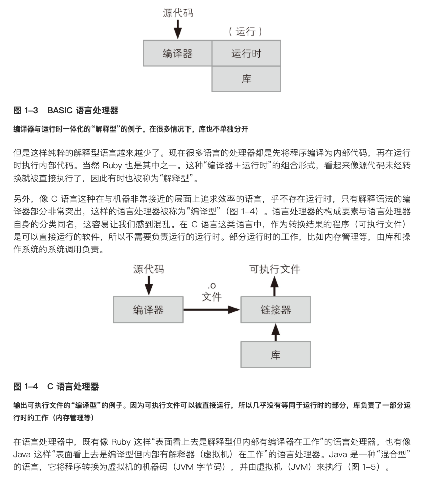
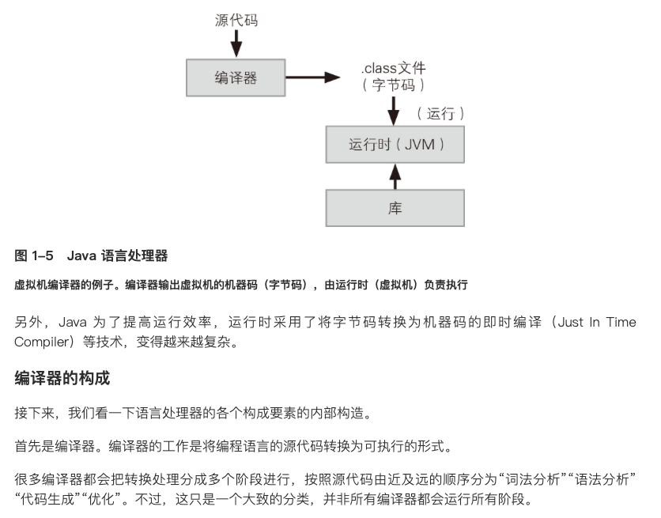

## 编译器的构成
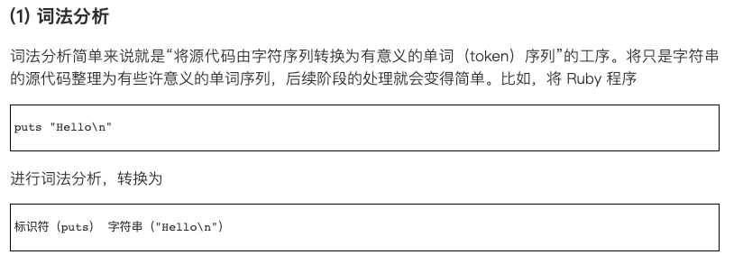
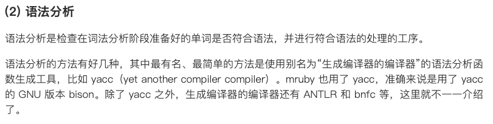
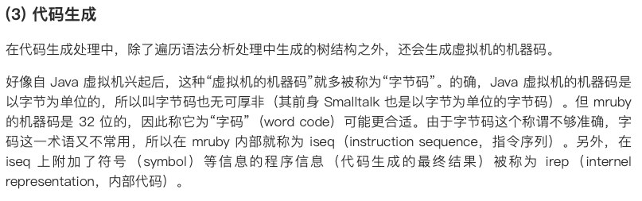

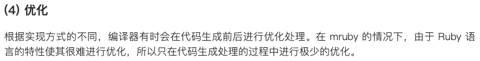

## 运行时
### 虚拟机
“运行源代码编译结果的是运行时。运行时有多种实现方法，本节要讲的虚拟机就是其中之一”

“虚拟机这个单词有多种不同的含义，本节中指“用软件实现的（无实际硬件的）计算机。
这与在虚拟机软件和云计算等语境中出现的虚拟机的含义不同。在虚拟机软件等语境中，虚拟机是指通过把实际存在的硬件用某种软件封装进行虚拟化，从而实现多个系统的同时运行以及系统在硬件间的迁移。维基百科中把这种虚拟机归类到了“系统虚拟机”中，而把本节所要介绍的虚拟机归类到了“进程虚拟机”中。”

#### 访问速度
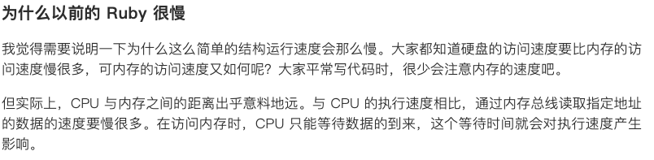
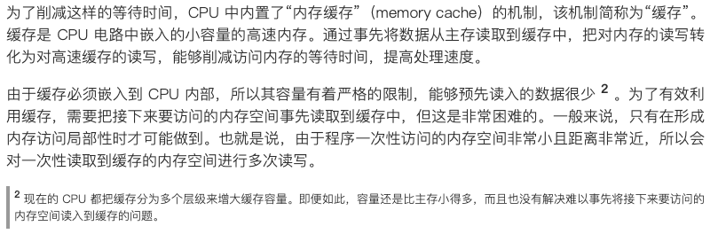
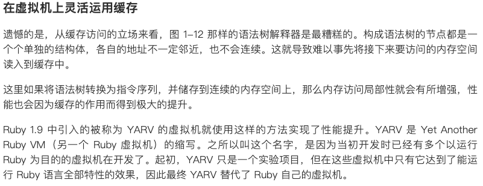

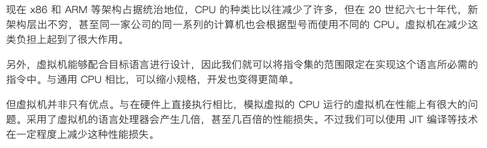

#### 虚拟机的实现技术


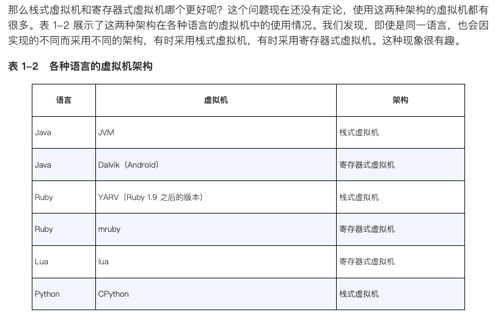


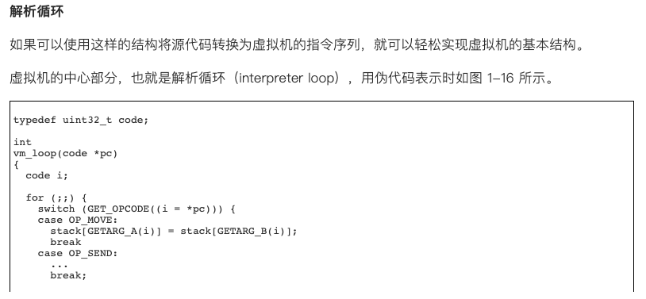
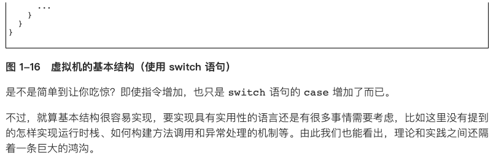
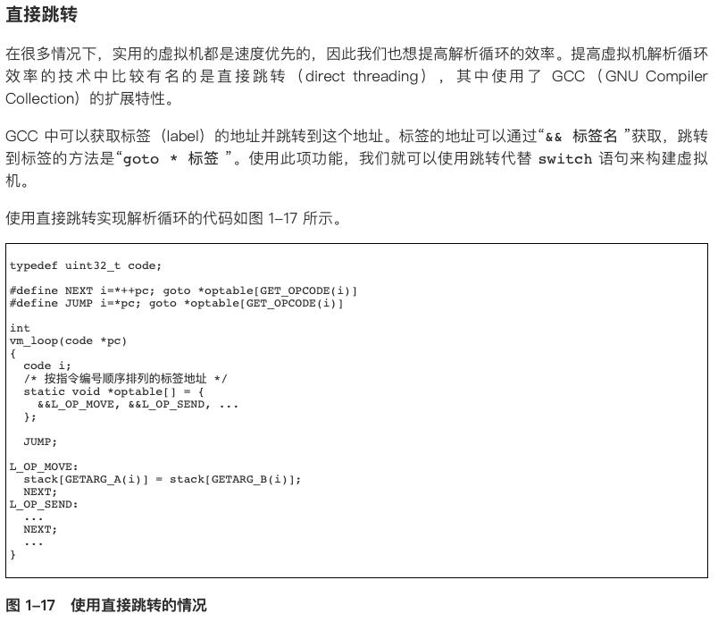
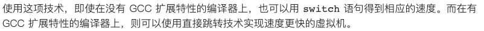

# 编程语言设计入门
开始实现
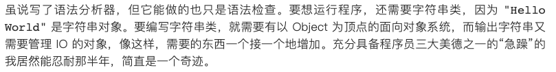
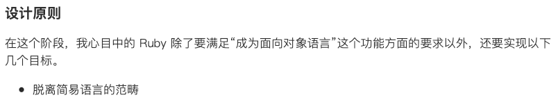


```commandline
变量名
让局部变量变得简洁
给脚本语言增加面向对象功能
单一继承对多重继承
单一继承的问题
Mix-in
模块
错误处理
异常的关键字
代码块
 
```
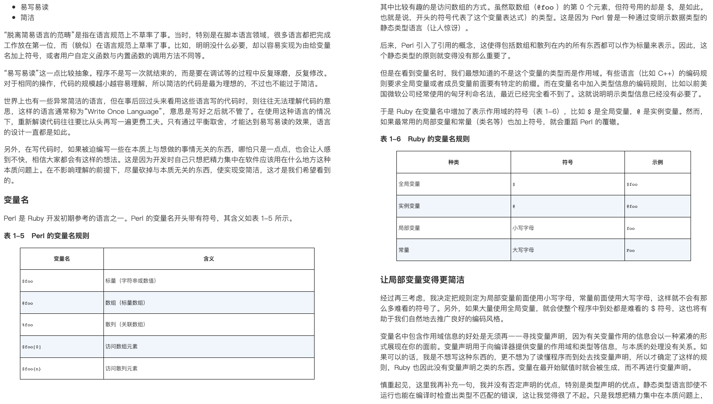
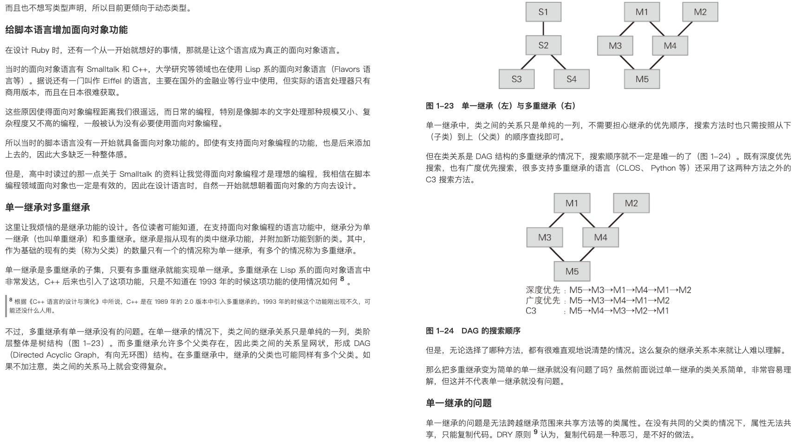
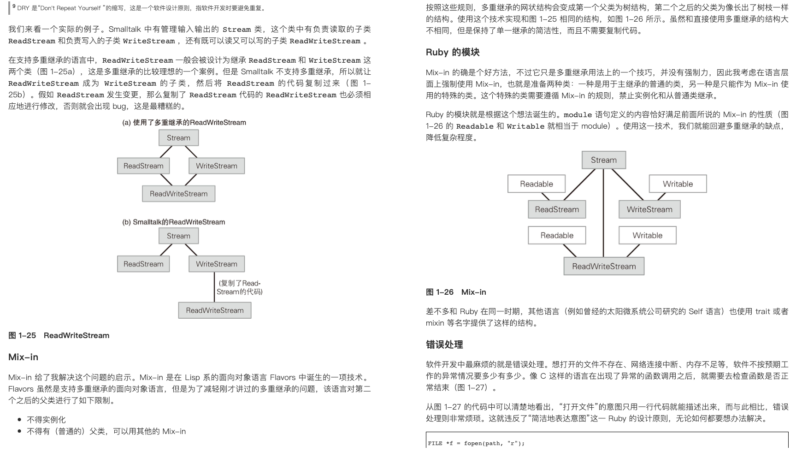
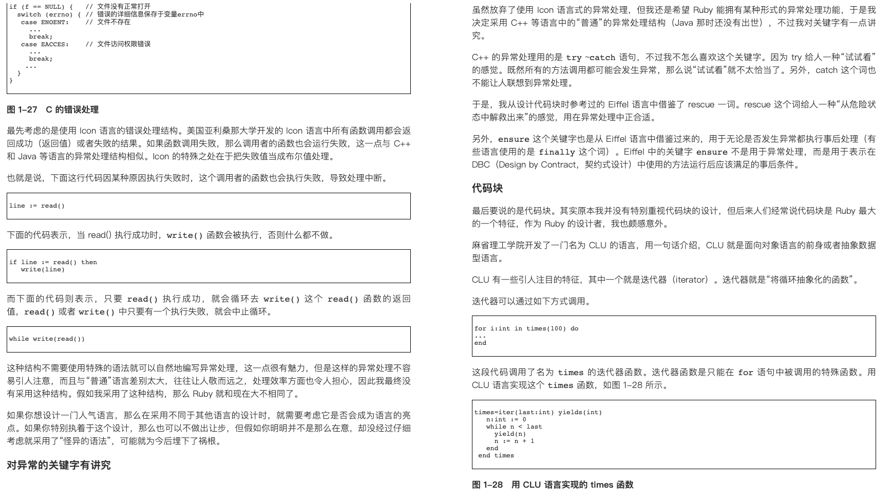
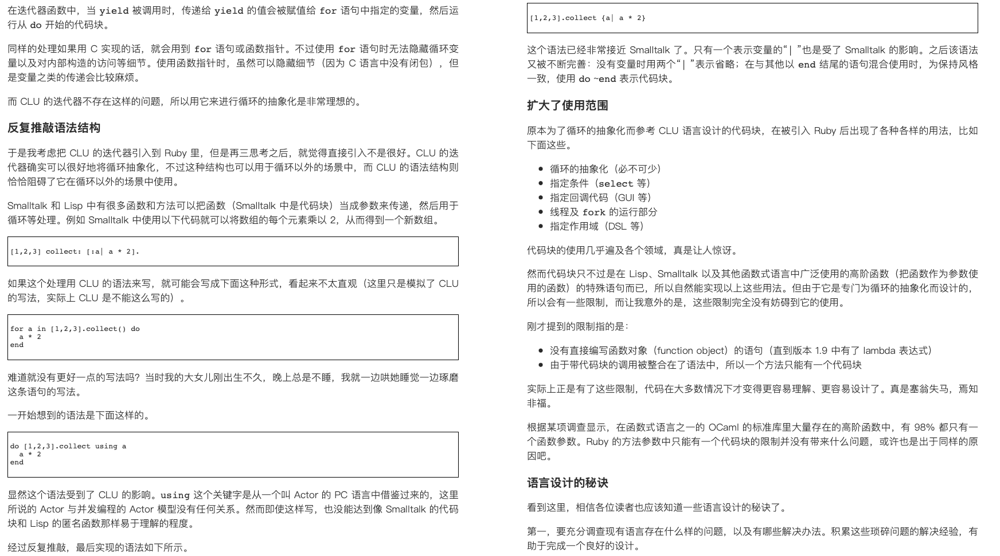

## 语言设计的秘诀
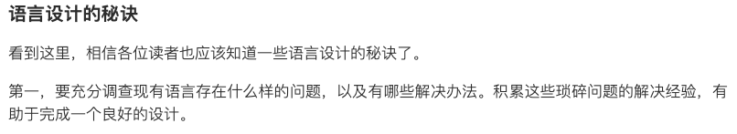
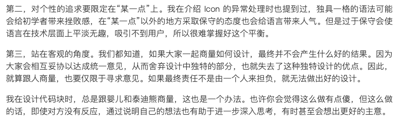


# python, java, go, c++语言的特征、区别、适合的使用场景
**Python**
特征：Python是一种解释型、面向对象、动态数据类型的高级程序设计语言。它的语法简洁明了，注重代码可读性，拥有大量的标准库和第三方库，应用广泛。

使用场景：可用于开发各种应用，如Web开发、科学计算、数据分析、机器学习、人工智能、游戏开发等。

**Java**
特征：Java是一种跨平台的，面向对象的程序设计语言。它的理念是 “一次编写，到处运行”。不管在何种硬件环境，只要有JVM（Java虚拟机），Java程序就可以运行。

使用场景：广泛用于企业级应用、Android开发、大数据处理、云计算等领域。

**Go**
特征：Go（也被称为Golang）是一种静态强类型、编译型、并发型，具有垃圾回收功能的编程语言。Go的性能接近C++，而且支持并发，因此执行效率极高。

使用场景：主要用于系统开发和网络编程，比如网络服务器、数据管道、机器学习等。

**C++**
特征：C++是一种在C语言基础上开发的面向对象的编程语言，具有灵活和高效的特质。C++为开发者提供了极大的控制空间，支持手动内存管理和硬件级操作。

使用场景：适合开发操作系统、游戏引擎、桌面应用、性能要求高的服务器等。

**它们之间的区别：**

1. 类型：Python是动态类型，Java、Go和C++是静态类型。
2. 编辑方式：Python和Java是解释型语言，而Go和C++是编译型语言。
3. 并发关键词：只有Go语言有自己的并发关键词goroutine和channel。
4. 内存管理：除C++外，其余三种语言都有自动垃圾回收机制。
5. 执行效率：通常来说，C++和Go的执行效率高于Python和Java。
6. 代码量：Python语言精简，代码相比其他语言更少。
7. 应用场景：各有自己擅长的领域，如Python擅长数据处理和AI，Java适用于企业级应用，Go适合系统和网络编程，C++适合系统底层和对性能要求极高的场景。