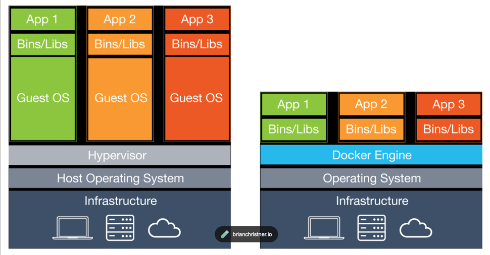
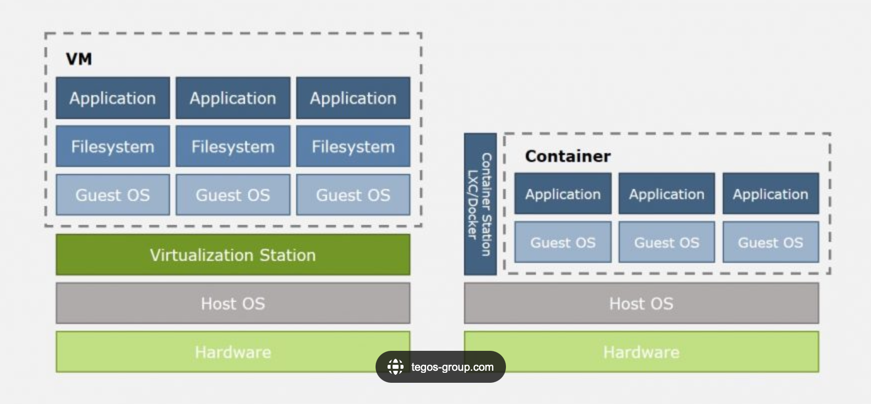

- What's the different between VM and Docker?

组成
资源消耗
隔离性

VM: Virtual Machine, a virtualized environment, which is a complete operating system, including the application, libraries, and dependencies. It is a complete copy of the operating system, which is isolated from the host machine.

Docker: a containerized environment, which is a virtualized environment, but it is not a complete operating system, it is just a container, which is isolated from the host machine.

