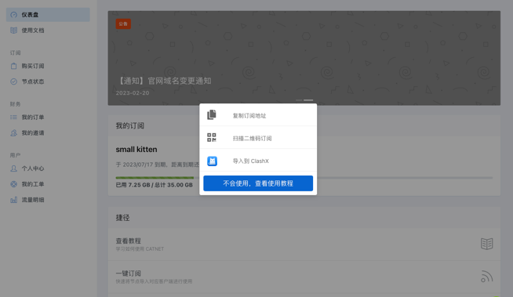
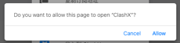
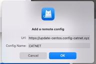
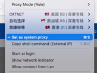
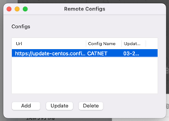

# TOOLS
## ClashX

### Install
[ClashX for Mac](https://github.com/yichengchen/clashX)
[Clash](https://github.com/Dreamacro/clash)

### How to update subscription
When subscription failed. All lines are RED.

1. Open URL: https://console.catnet.uk/#/dashboard
2. Login with user/password or fingerprint verification(I've got password saved with account)
3. Click 一键订阅->导入到ClashX
   
4. Allow -> OK
   
   

   

5. It may raise "Download failed" on "Remote Configs"
   Untick "Set as system proxy" and Update the remote configs
   

   
6. After update the subsription, you can use the clashX again
   
   The image looks small, emmm...